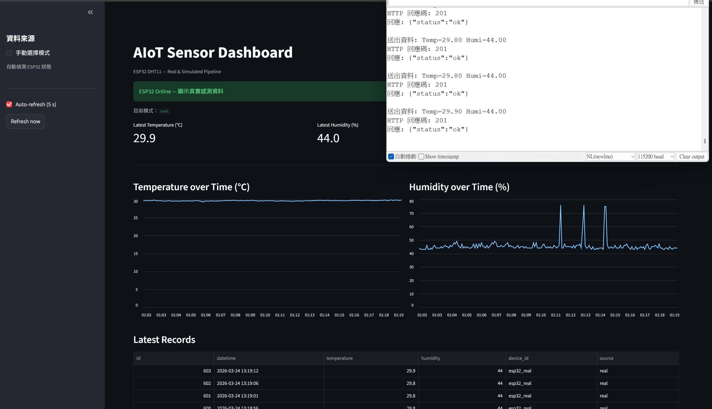

# AI 協作對話摘要 — HW1-1 Client Side IoT

本文件摘要兩段 AI 輔助開發對話：
1. **ChatGPT**（初版作業引導，逐步完成 HW1-1）
2. **Claude**（系統升級、雙管道架構、Dashboard、部署）

---

## Part 1 — ChatGPT 對話摘要

> 來源：chatgpt對話.pdf（40頁）

### 對話目標

逐步完成 HW1-1 四個章節，每章確認完成再進入下一章。

---

### CH1｜LED Flash

**使用者：** 要協助我完成物聯網作業，作業內容包含 LED Flash / DHT11 / SQLite / WiFi。

**ChatGPT：** 帶領逐章完成，先從 LED Flash 開始，提供 GPIO2 控制程式碼與接腳圖。

```cpp
#define LED_PIN 2
void setup() { pinMode(LED_PIN, OUTPUT); }
void loop() {
  digitalWrite(LED_PIN, HIGH); delay(1000);
  digitalWrite(LED_PIN, LOW);  delay(1000);
}
```

**接腳圖：**
```
[ESP32 GPIO2] → [LED] → GND
```

**結果：** 第1章完成。

---

### CH2｜DHT11 Serial Monitor

**ChatGPT：** 提供 DHT11 接線與程式碼，說明需安裝 `Adafruit DHT` 函式庫。

```
DHT11 → ESP32
VCC  → 3.3V
DATA → GPIO 4
GND  → GND
```

```cpp
#include <DHT.h>
#define DHTPIN 4
#define DHTTYPE DHT11
DHT dht(DHTPIN, DHTTYPE);
void loop() {
  float h = dht.readHumidity();
  float t = dht.readTemperature();
  if (isnan(h) || isnan(t)) return;
  Serial.print("濕度: "); Serial.print(h);
  Serial.print(" %  溫度: "); Serial.println(t);
  delay(2000);
}
```

**Serial Monitor 實測：**
```
濕度: 95.00 %   溫度: 33.50 °C
濕度: 79.00 %   溫度: 33.70 °C
濕度: 61.00 %   溫度: 33.60 °C
```

**結果：** 第2章完成。

---

### CH3｜SQLite 隨機資料模擬

**使用者：** 3、4 階段是有連貫的，3 是用 random data 模擬 DHT11，4 是用 WiFi 傳實際值。

**ChatGPT：** 確認理解正確，提供修正版（DHT11 溫濕度 random，非 WiFi 資料）：

```python
import sqlite3, random, time
conn = sqlite3.connect("aiotdb.db")
cursor.execute("""
CREATE TABLE IF NOT EXISTS dht11_data (
    id INTEGER PRIMARY KEY AUTOINCREMENT,
    temperature REAL, humidity REAL, timestamp INTEGER
)""")
for _ in range(20):
    cursor.execute("INSERT INTO dht11_data VALUES (?, ?, ?, ?)",
        (None, random.uniform(20,35), random.uniform(40,80), int(time.time())))
conn.commit()
```

**關鍵說明：**
- 第3章 = 假資料 pipeline（驗證 DB 流程）
- 第4章 = 真資料 pipeline（真正 IoT）
- 若第3章用 WiFi 資料 → 被扣分

**結果：** 第3章完成（DHT11版）。

---

### CH4｜WiFi 傳輸 + Flask + SQLite 串接

**使用者：** 可以延續第3章存成 SQLite 嗎？

**ChatGPT：** ESP32 無法直接寫 SQLite（記憶體不足），正確架構為：

```
[ESP32 + DHT11] → WiFi (HTTP) → [Flask Server PC] → [SQLite aiotdb.db]
```

提供完整 Flask Server（`server.py`）與 ESP32 程式碼：

```python
@app.route("/data")
def receive_data():
    temp = request.args.get("temp")
    humi = request.args.get("humi")
    cur.execute("INSERT INTO dht11_data VALUES (?, ?, ?, ?)",
                (None, temp, humi, int(time.time())))
    return "OK"
app.run(host="0.0.0.0", port=5000)
```

```cpp
String serverName = "http://192.168.x.x:5000/data";
http.begin(serverName + "?temp=" + String(t) + "&humi=" + String(h));
http.GET();
```

**實測成功輸出：**
```
連線中......   WiFi 連線成功！   10.162.30.52
送出資料: Temp=28.90 Humi=52.00   HTTP 回應碼: 200
```

**Flask Log：**
```
收到資料: Temp=28.90, Humi=52.00
10.162.30.52 - "GET /data?temp=28.90&humi=52.00 HTTP/1.1" 200 -
```

**SQLite 寫入成功（21~24筆）：**

| id | temperature | humidity | timestamp  |
|----|------------|----------|------------|
| 21 | 28.9       | 52       | 1774279841 |
| 22 | 28.1       | 60       | 1774279846 |

**老師評分建議（ChatGPT）：**

| 等級 | 內容 | 評分 |
|------|------|------|
| 基本 | httpbin HTTP 200 | 普通完成 |
| 進階 | Flask + SQLite | 高分 |
| 強者 | DB + 視覺化 Dashboard | 滿分 |

**使用者：** 串接完成，幫我整理報告用 md 附上程式碼。

**ChatGPT：** 產生完整 Markdown 報告（即 `AIOT-HW1.pdf` 內容）。

---

## Part 2 — Claude 對話摘要

> 本次對話（升級為完整 AIoT 系統）

### 目標

在 HW1-1 基礎上升級為完整雙管道 AIoT 系統，加入 Dashboard 與部署。

---

### 升級1｜ESP32 GET → POST JSON

**使用者：** 提供現有 `WIFI_DHT11.ino` 與 `server.py`，要求升級為 POST JSON 格式。

**Claude：** 修改 ESP32 韌體加入 `ArduinoJson`，endpoint 改為 `/sensor`，payload 加入 `device_id` 與 `source` 欄位。

```json
{
  "temperature": 29.9,
  "humidity": 44.0,
  "device_id": "esp32_real",
  "source": "real"
}
```

---

### 升級2｜Flask app.py（多端點 + 錯誤處理）

**Claude：** 基於 `server.py` 升級為 `app.py`：

| 端點 | 說明 |
|------|------|
| `POST /sensor` | 接收 JSON，HTTP 201 |
| `GET /health` | 回傳 ESP32 在線狀態 |
| `GET /data` | 最新 50 筆 JSON |

資料表從 `dht11_data`（3欄）升級為 `sensors`（5欄，含 device_id、source）。

---

### 升級3｜自動模擬背景執行緒

**使用者：** 切換 mock 沒有模擬資料進來。

**Claude：** 將 `esp32_sim.py` 邏輯內建至 `app.py` 背景執行緒 `sim_loop()`：
- ESP32 在線 → 模擬暫停
- ESP32 離線（30秒無 real 資料）→ 每 15 秒自動補一筆 simulated

---

### 升級4｜Streamlit Dashboard

**Claude：** 建立 `dashboard.py`，功能包含：
- KPI 卡（最新溫度、濕度、總筆數）
- 折線圖（溫度 / 濕度時序）
- 自動偵測 ESP32 在線狀態，自動切換 real / simulated
- 手動覆蓋模式（sidebar）

**使用者：** 不要混合，只要可以切換，沒 sensor 才切 mock。

**Claude：** 改為單一來源模式（`WHERE source=?`），不再 All 混合顯示。

---

### 升級5｜雲端 Demo 平滑化

**使用者：** 雲端讓其更新平滑一點，不要突然跳一下。

**Claude：** 改用 `st.session_state` + random walk：
- 初次：seed 40 筆平滑資料
- 每次 rerun：只新增 1 筆（±0.4°C / ±1%），移除最舊一筆
- 效果：曲線平緩漂移，無突變

---

### 升級6｜GitHub + Streamlit Cloud 部署

**使用者：** 推上 git 並部署 Streamlit。

**Claude：**
1. 初始化 git repo，設定 `.gitignore`（排除 venv、aiotdb.db、PDF）
2. Push 至 `https://github.com/roy12358/AIOT-HW1`
3. 更新 `dashboard.py` 加入 `CLOUD_MODE`（無 DB 時產生 in-memory demo 資料）
4. 部署至 Streamlit Cloud

**Live Demo：** https://roy-aiot-hw1.streamlit.app/

---

### 實測結果（本地 ESP32 真實資料）



| 項目 | 數值 |
|------|------|
| 總筆數 | 389 筆 |
| Real ESP32 | 270 筆 |
| Simulated | 119 筆 |
| 溫度平均 | 29.7°C（min 25.6 / max 30.9） |
| 濕度平均 | 46.0% |
| 記錄時段 | 2026-03-24 19:34 ～ 21:00 |

---

## 整體開發流程總結

```
ChatGPT 引導                        Claude 升級
────────────────────                ─────────────────────────────
CH1 LED Flash                       ESP32 GET → POST JSON
CH2 DHT11 Serial Monitor       →    Flask 多端點 + 錯誤處理
CH3 SQLite random data              自動模擬背景執行緒 sim_loop
CH4 WiFi + Flask + SQLite           Streamlit Dashboard
      ↓                             雲端 demo random walk 平滑化
  server.py (初版)                  GitHub + Streamlit Cloud 部署
  WIFI_DHT11.ino (初版)                  ↓
                                    app.py / dashboard.py (升級版)
                                    https://roy-aiot-hw1.streamlit.app
```
